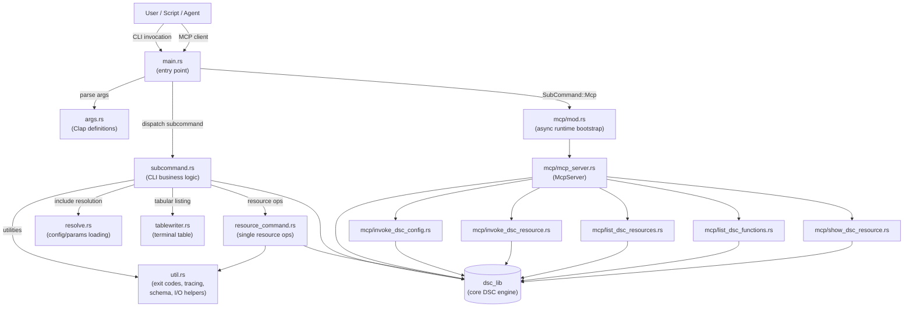
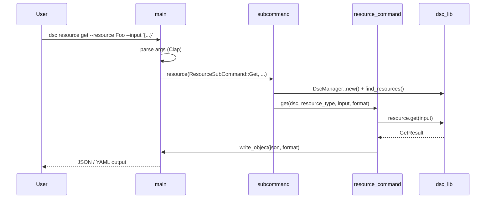
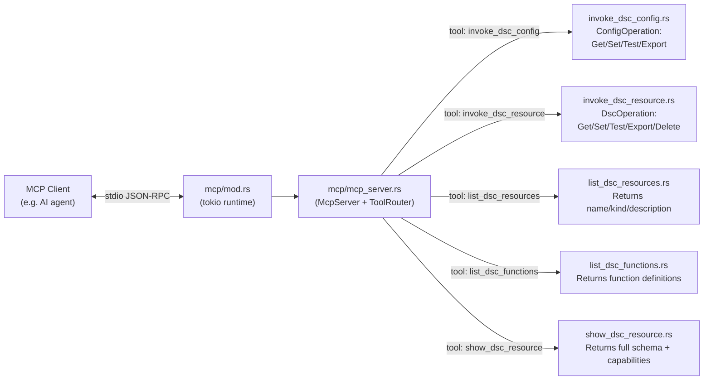

# `dsc` Binary — Source Overview

This folder contains the source code for the `dsc` command-line binary. The binary is the primary entry point for all DSC operations. It handles argument parsing, input pre-processing, dispatches work to `dsc_lib`, and formats output for the caller.

## High-Level Architecture

The binary is organized into two parallel execution paths: the **CLI path** for interactive and scripted use, and the **MCP path** for AI-agent use via the [Model Context Protocol](https://modelcontextprotocol.io).

## CLI Subcommand Flow

Each top-level subcommand routes through `main.rs` into `subcommand.rs`. Configuration subcommands additionally pass through input normalization and the `Configurator` from `dsc_lib`.

## MCP Server Architecture

When invoked as `dsc mcp`, the binary starts an async MCP server over stdio. Each MCP tool is a method on `McpServer` that offloads blocking DSC work onto a `tokio::task::spawn_blocking` thread.

---

## Source File Reference

### `main.rs`

The binary entry point. Responsibilities:

- Parses global flags (`--trace-level`, `--trace-format`, `--progress-format`) and the top-level subcommand using `Args::parse()` from `args.rs`.
- Initializes tracing via `util::enable_tracing`.
- Installs a `Ctrl+C` handler (`ctrlc_handler`) that walks the process tree using `sysinfo` and terminates all child processes before exiting with `EXIT_CTRL_C`.
- On Windows, detects if the binary was launched from the Microsoft Store shell and shows a friendly error.
- In debug builds, optionally pauses startup to allow a debugger to attach when `DEBUG_DSC` is set.
- Dispatches each `SubCommand` variant to the appropriate function in `subcommand.rs`, or starts the MCP server via `mcp::start_mcp_server`.

---

### `args.rs`

Declares the complete CLI surface using [Clap](https://docs.rs/clap). Key types:

| Type | Purpose |
|---|---|
| `Args` | Root struct: global flags + `SubCommand` |
| `SubCommand` | Top-level commands: `config`, `resource`, `extension`, `function`, `schema`, `completer`, `mcp` |
| `ConfigSubCommand` | Config operations: `get`, `set`, `test`, `validate`, `export`, `resolve` |
| `ResourceSubCommand` | Single-resource operations: `get`, `set`, `test`, `delete`, `export`, `schema`, `list` |
| `ExtensionSubCommand` | Extension operations: `list` |
| `FunctionSubCommand` | Function operations: `list` |
| `SchemaType` | Enum of DSC JSON schema types emittable by `dsc schema` |
| `OutputFormat` / `GetOutputFormat` / `ListOutputFormat` | Per-command output format enums |
| `TraceFormat` | Tracing output format: `Default`, `Plaintext`, `Json`, `PassThrough` |

All help strings are looked up via `rust_i18n` to support localization.

---

### `subcommand.rs`

Contains the business logic invoked by `main.rs` for each CLI subcommand. It bridges Clap argument types with `dsc_lib` APIs.

Key public functions:

| Function | Description |
|---|---|
| `config(...)` | Orchestrates `config` subcommands. Resolves include documents, merges parameters, constructs a `Configurator`, then delegates to `config_get/set/test/export/validate`. |
| `config_get/set/test/export` | Thin wrappers that call `configurator.invoke_*()` and serialize the result. |
| `validate_config(...)` | Validates a configuration document against its JSON schema, then validates each resource's properties using `dsc_lib`. |
| `resource(...)` | Dispatches single-resource subcommands to `resource_command`. |
| `extension(...)` | Lists available DSC extensions. |
| `function(...)` | Lists available DSC expression functions. |
| `list_resources(...)` | Enumerates resources via `DscManager`, writing tabular or JSON/YAML output. |
| `list_extensions(...)` | Enumerates extensions, rendering capability flags (`d`iscover / `s`ecret / `i`mport). |
| `list_functions(...)` | Lists expression functions with wildcard name filtering, rendering argument type flags. |
| `initialize_config_root(...)` | Sets the `DSC_CONFIG_ROOT` environment variable from the config file path so that relative resource paths resolve correctly. |

---

### `resource_command.rs`

Handles individual DSC resource invocations. Each function resolves the resource by type name, validates preconditions, calls the appropriate `dsc_lib` trait method, and serializes the result.

| Function | Description |
|---|---|
| `get(...)` | Invokes `resource.get(input)`. Supports `PassThrough` format to emit raw state. |
| `get_all(...)` | Invokes `resource.export()` and streams each instance as a `GetResult`. |
| `set(...)` | Invokes `resource.set(input)`. When `_exist=false` and the resource has `Delete` capability but not `SetHandlesExist`, routes to `delete` and synthesizes a `SetResult`. |
| `test(...)` | Invokes `resource.test(input)`. |
| `delete(...)` | Invokes `resource.delete(input)`. Supports `what_if` mode via `ExecutionKind`. |
| `export(...)` | Invokes `resource.export()` and emits the result as a configuration document. |
| `schema(...)` | Emits the JSON schema for the named resource. |
| `get_resource(...)` | Helper: looks up a resource by fully-qualified type name and version using `DscManager`. |

---

### `resolve.rs`

Handles the `include` resource, which lets a DSC configuration embed another configuration document by file path or inline content.

Key types:

| Type | Description |
|---|---|
| `Include` | Top-level struct with a configuration source and optional parameters source. |
| `IncludeKind` | Either `configurationFile(path)` or `configurationContent(text)`. |
| `IncludeParametersKind` | Either `parametersFile(path)` or `parametersContent(text)`. |

Key function:

- **`get_contents(input)`** — Deserializes an `Include` from JSON, reads and parses the referenced configuration (YAML or JSON), reads the optional parameters, and returns `(Option<params_json>, config_json)`.
- Path normalization prevents directory traversal: file paths are validated relative to `DSC_CONFIG_ROOT` and must not escape the root directory.

---

### `tablewriter.rs`

A minimal terminal table renderer used when listing resources, extensions, and functions interactively.

| Member | Description |
|---|---|
| `Table::new(headers)` | Creates a table, initializing column widths to the header lengths. |
| `Table::add_row(row)` | Appends a row, expanding column widths as needed. |
| `Table::print(truncate)` | Renders the table to stdout. Headers are styled bright green. If `truncate` is true, rows wider than the terminal are trimmed with a `…` ellipsis. |

---

### `util.rs`

Shared utilities used throughout the binary.

**Exit codes:**

| Constant | Value | Meaning |
|---|---|---|
| `EXIT_SUCCESS` | 0 | Normal exit |
| `EXIT_INVALID_ARGS` | 1 | Bad CLI arguments |
| `EXIT_DSC_ERROR` | 2 | DSC engine error |
| `EXIT_JSON_ERROR` | 3 | JSON serialization failure |
| `EXIT_INVALID_INPUT` | 4 | Bad input document |
| `EXIT_VALIDATION_FAILED` | 5 | Schema validation failure |
| `EXIT_CTRL_C` | 6 | Interrupted by Ctrl+C |
| `EXIT_DSC_RESOURCE_NOT_FOUND` | 7 | Named resource not found |
| `EXIT_DSC_ASSERTION_FAILED` | 8 | Assertion resource test failed |
| `EXIT_MCP_FAILED` | 9 | MCP server error |
| `EXIT_BICEP_FAILED` | 10 | Bicep compilation error |

**Key functions:**

| Function | Description |
|---|---|
| `enable_tracing(level, format)` | Configures `tracing_subscriber` with optional `indicatif` progress bars. Reads trace settings from `dsc.settings.json` and respects the `DSC_TRACE_LEVEL` environment variable override. |
| `get_input(input, file)` | Reads input from an inline string, a file path, or stdin (when path is `"-"`). Converts YAML to JSON automatically. |
| `write_object(json, format, separator)` | Writes a JSON string to stdout, optionally converting to YAML or pretty-printing, with optional NDJSON newline separator and syntax highlighting when writing to a terminal. |
| `get_schema(schema_type)` | Returns a `schemars::Schema` for the requested DSC type. |
| `merge_parameters(file, inline)` | Merges two JSON parameter objects, with inline values taking precedence. |
| `set_dscconfigroot(path)` | Sets `DSC_CONFIG_ROOT` to the directory portion of a config file path. |
| `in_desired_state(result)` | Returns `true` if all properties in a `ResourceTestResult` are in the desired state. |

---

### `mcp/mod.rs`

Bootstrap module for the MCP server. Provides:

- **`start_mcp_server()`** — Synchronous entry point called from `main.rs`. Creates a `tokio` runtime and blocks on `start_mcp_server_async()`.
- **`start_mcp_server_async()`** — Creates a `McpServer`, wraps it in an `rmcp` service over stdio transport, and awaits completion.

---

### `mcp/mcp_server.rs`

Defines `McpServer`, the central MCP handler struct. It aggregates five `ToolRouter` instances (one per tool module) into a single composite router using the `+` operator. Implements `rmcp::ServerHandler` to handle the MCP `initialize` handshake and route all tool calls.

---

### `mcp/invoke_dsc_config.rs`

MCP tool **`invoke_dsc_config`**: runs a full DSC configuration operation.

- **Input**: `ConfigOperation` (`get`/`set`/`test`/`export`), a YAML configuration string, and optional YAML parameters.
- **Output**: The corresponding `ConfigurationGetResult`, `ConfigurationSetResult`, `ConfigurationTestResult`, or `ConfigurationExportResult`.
- Parses the YAML configuration and parameters, constructs a `Configurator`, and invokes the requested operation via `dsc_lib`.

---

### `mcp/invoke_dsc_resource.rs`

MCP tool **`invoke_dsc_resource`**: invokes a single DSC resource operation.

- **Input**: `DscOperation` (`get`/`set`/`test`/`export`/`delete`), a fully-qualified resource type name, and the resource properties as a JSON string.
- **Output**: The corresponding result type wrapped in `ResourceOperationResult`.
- Resolves the resource via `DscManager` and dispatches to the appropriate `Invoke` trait method.

---

### `mcp/list_dsc_resources.rs`

MCP tool **`list_dsc_resources`**: enumerates available DSC resources.

- **Input**: Optional `adapter` type name to return only resources adapted by that adapter.
- **Output**: A list of `ResourceSummary` objects with `type`, `kind`, `description`, and `requireAdapter`.
- Validates that the specified adapter is actually of `Kind::Adapter` before filtering.

---

### `mcp/list_dsc_functions.rs`

MCP tool **`list_dsc_functions`**: lists available DSC expression functions.

- **Input**: Optional `function_filter` string with wildcard support (`*`, `?`).
- **Output**: A list of `FunctionDefinition` objects with name, category, argument types, and description.
- Uses `FunctionDispatcher` from `dsc_lib` and applies case-insensitive regex filtering.

---

### `mcp/show_dsc_resource.rs`

MCP tool **`show_dsc_resource`**: returns detailed information about a specific DSC resource.

- **Input**: A fully-qualified resource type name.
- **Output**: A `DscResource` struct containing `type`, `kind`, `version`, `capabilities`, `description`, `author`, and the resource's full JSON schema.
- The schema is retrieved via `resource.schema()` and deserialized to a `serde_json::Value` for inclusion in the response.
